# 📝 NoteNest – Smart Notes Web Application

Live website:  
[🔗 View NoteNest Live](https://nic1mic.github.io/milestone2-note-nest/)

Repository:  
[🔗 GitHub Repository](https://github.com/Nic1Mic/milestone2-note-nest)

---

## 1. Project Overview

NoteNest is an innovative front-end notes application designed in line with the elegance of the Google Keep web application. The NoteNest app enables users to create, organize, edit, search, favorite, delete, undelete, and purge notes.

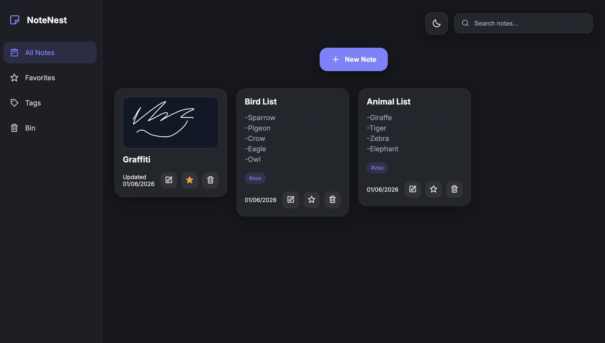

The app supports three note types:

- Writing notes
- Drawing notes
- Image notes

The project focuses on clean design, responsive layout, accessible structure, and dynamic JavaScript functionality.

This project was developed as part of assessment to demonstrate:

- HTML5 structure
- CSS3 styling and responsive design
- JavaScript DOM manipulation
- Dynamic front-end interactivity
- Git & GitHub version control
- GitHub Pages deployment
- Professional documentation practices

---

## 2. User Experience (UX)

### 2.1 Project Goals

#### Project Goals

- Build a note-taking application
- Provide multiple ways to create notes
- Keep the interface simple and user friendly
- Allow users to organise and manage notes easily
- Demonstrate strong front-end development skills

#### User Goals

- Create notes quickly
- Save notes automatically
- Search notes easily
- Mark important notes as favourites
- Add tags for organisation
- Upload image notes
- Create drawing notes
- Recover deleted notes from the bin
- Use the app comfortably in dark or light mode

---

### 2.2 User Stories

#### First-time visitor

As a first-time visitor:

- I want to understand what the app does quickly.
- I want to create a note without needing instructions.
- I want the interface to feel simple and easy to use.

#### Returning user

As a returning user:

- I want to search through my notes quickly.
- I want to favourite important notes.
- I want to organise notes using tags.

---

### 2.3 Design Choices

#### Colour Scheme

The app uses a modern dark theme by default with a purple accent colour. A light mode toggle is also included so users can switch the interface depending on preference or lighting conditions.

#### Typography

A clean sans-serif font is used to keep the interface readable and modern.

#### Layout

The layout uses:

- A collapsible sidebar
- A top search area
- A central new note button
- A masonry-style notes layout
- Modal popups for note creation and editing

#### Interactivity

The interface includes:

- Hover-expanding sidebar
- Modal note editor
- Dynamic note rendering
- Search filtering
- Favourite toggling
- Bin and restore functionality
- Dark/light mode toggle

---

### 2.4 Wireframes

Wireframes were created to plan the overall structure and user flow.

The wireframes helped plan:

- Sidebar navigation
- New note button placement
- Notes grid layout
- Modal popup design
- Image note layout
- Drawing note layout
- Responsive behaviour

Wireframe tool used: [A link to Figma Wireframing](https://www.figma.com/design/95MqDPb0JQ63EfEdE4ELUI/NestNote?node-id=0-1&t=RTnwPihcE9Ruqngl-1)

---

## 3. Features

### Main Features

- Responsive sidebar navigation
- Sidebar expands on hover
- All Notes view
- Favourites view
- Tags view
- Bin view
- Create writing notes
- Create image notes
- Create drawing notes
- Edit existing notes
- Favourite notes
- Add tags to notes
- Search notes by title, content, or tags
- Move notes to bin
- Restore notes from bin
- Permanently delete notes
- Empty bin
- Dark/light mode toggle
- LocalStorage saving
- Responsive layout

---

### Writing Notes

Users can create text-based notes with:

- Title
- Body text
- Tags
- Favourite option

---

### Image Notes

Users can upload an image and save it as a note. Image notes can also include:

- Title
- Caption
- Tags
- Favourite option

---

### Drawing Notes

Users can draw directly inside the browser using the HTML Canvas API. Drawing notes include:

- Canvas drawing area
- Pen colour picker
- Brush size control
- Clear canvas button
- Caption
- Tags
- Favourite option

---

### Notes Management

Users can:

- Edit saved notes
- Favourite notes
- Move notes to bin
- Restore notes
- Permanently delete notes
- Empty the bin

---

## 4. Technologies Used

### Languages

- HTML5
- CSS3
- JavaScript

### Browser APIs

- LocalStorage API
- FileReader API
- HTML Canvas API

### Tools

- Git
- GitHub
- GitHub Pages
- VS Code
- W3C HTML Validator
- W3C CSS Validator
- Chrome DevTools Lighthouse

### External Resources

- Boxicons for icons

---

## 5. Folder Structure

```text
milestone2-note-nest/
│
├── assets/
├── images/
│   ├── final-product/
│   ├── testing/
│   ├── validators/
│   └── wireframes/
├── css/
│   └── style.css
├── js/
│   └── app.js
├── index.html
└── README.md
```
---

## 6. Deployment

### 6.1 GitHub Pages Deployment

The project was deployed using GitHub Pages.

#### Deployment Steps

1. Log into GitHub.
2. Open the project repository.
3. Navigate to **Settings**.
4. Select **Pages** from the left-hand menu.
5. Under **Build and Deployment**:
   - Source: Deploy from a branch
   - Branch: main
   - Folder: / (root)
6. Click **Save**.
7. Wait for GitHub Pages to publish the website.

### Live Website

[🔗 View NoteNest Live](https://nic1mic.github.io/milestone2-note-nest/)

---

### 6.2 Running Locally

To run this project locally:

```bash
git clone https://github.com/Nic1Mic/milestone2-note-nest.git
```

Open the project folder and launch:

```text
index.html
```

in your browser.

---

## 7. Testing

Testing was carried out throughout development and after deployment to ensure functionality, responsiveness, accessibility, and usability.

### Testing User Stories from User Experience (UX) Section

#### First-Time Visitor – Understand the App

**User Story:**  
_As a first-time visitor, I want to quickly understand what the app does and how to create notes._

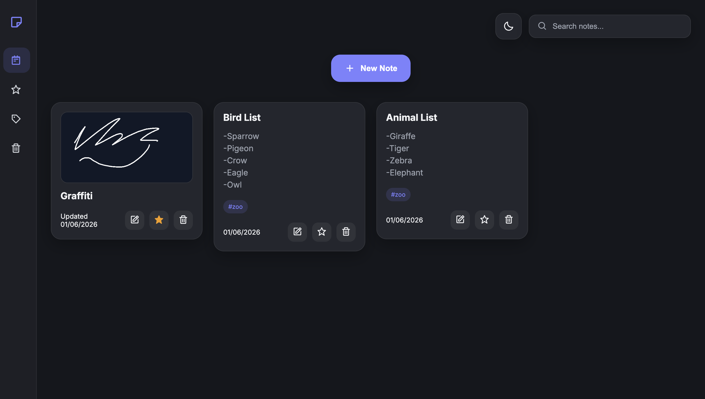

The homepage presents a clear layout with a visible "New Note" button, navigation sidebar, and notes area. Users can immediately understand the purpose of the application and begin creating notes without instructions.

---

#### First-Time Visitor – Create a Note Easily

**User Story:**  
_As a first-time visitor, I want to create a note without needing technical knowledge._


The "New Note" button opens simple note creation options allowing users to choose between writing, drawing, or image notes.

---

#### Returning User – Search Notes Quickly

**User Story:**  
_As a returning user, I want to quickly find specific notes._

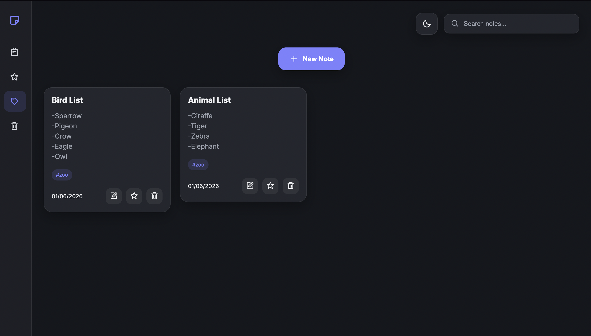

The search functionality dynamically filters notes based on titles, content, and tags, helping users find information efficiently.

---

#### Returning User – Manage Favourite Notes

**User Story:**  
_As a returning user, I want to save important notes in a favourites section._

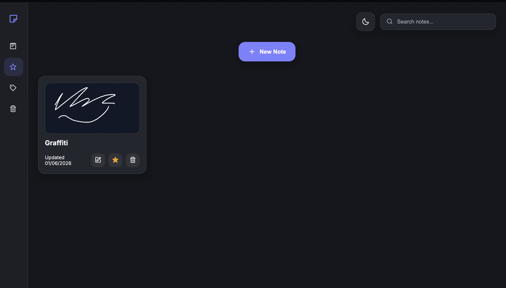

Users can mark notes as favourites and access them through the dedicated Favourites section in the sidebar.

---

#### Creative User – Create Drawing Notes

**User Story:**  
_As a creative user, I want to create visual notes using drawing tools._

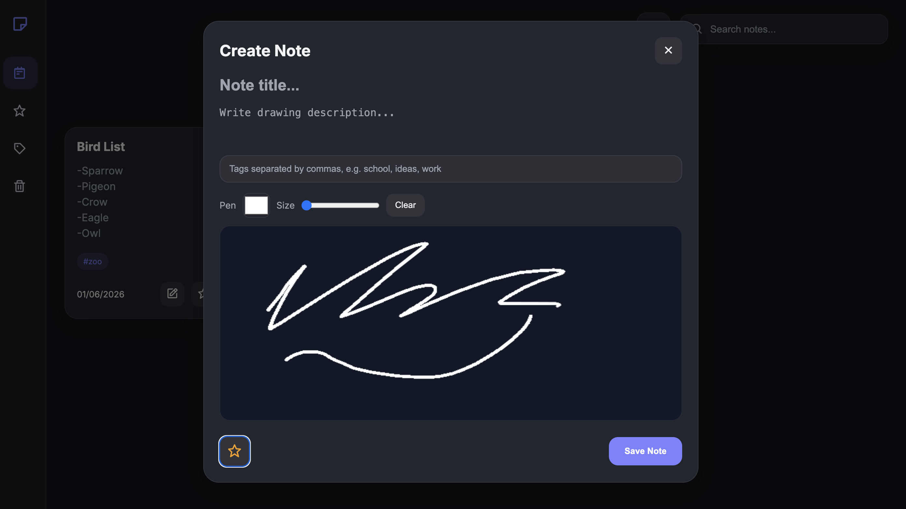

The drawing note feature uses the HTML Canvas API and allows users to sketch ideas directly inside the application.

---


### Testing Approach

Software testing can be carried out manually or through automated tools.

**Manual testing** In manual testing, an user uses the program to verify that every feature operates as it should. Clicking buttons, making notes, changing material, testing navigation, ensuring responsiveness, and verifying that data is retained after page refreshes are all examples of this.

**Automated testing** Checks code and behaviour automatically using frameworks, scripts, or validation tools. Particularly in larger applications, it is helpful for rapidly running tests and reliably discovering issues.

Because NoteNest is a front-end application with interactive features that are best tested by using the app as an end user, **manual testing** was the primary testing approach selected. Every feature underwent separate testing both during development and following deployment.

Automated tools were also used to support the manual testing process:

- W3C HTML Validator
- W3C CSS Validator
- JSHint for JavaScript
- Google Lighthouse for performance, accessibility, best practices, and SEO

This combined approach helped confirm that the application worked correctly, followed coding standards, and provided a good user experience.


---


### 7.1 Manual Testing

| Feature | Action | Expected Result | Outcome |
|----------|----------|----------|----------|
| Sidebar Navigation | Hover over sidebar | Sidebar expands and labels become visible | Pass |
| New Note Button | Click button | Note creation options appear | Pass |
| Writing Notes | Create and save note | Note appears in notes area | Pass |
| Drawing Notes | Draw and save note | Drawing note appears correctly | Pass |
| Image Notes | Upload image and save | Image note displays correctly | Pass |
| Edit Notes | Edit an existing note | Updated note is displayed | Pass |
| Favourites | Favourite a note | Note appears in Favourites section | Pass |
| Tags | Add tags to notes | Tags display correctly | Pass |
| Search | Search note content | Matching notes are displayed | Pass |
| Bin | Delete note | Note moves to Bin section | Pass |
| Restore | Restore deleted note | Note returns to active notes | Pass |
| Empty Bin | Delete all bin notes | Bin becomes empty | Pass |
| Theme Toggle | Switch theme | Dark/Light mode changes correctly | Pass |
| Local Storage | Refresh page | Notes remain saved | Pass |
| Responsive Layout | Resize browser | Layout adapts correctly | Pass |

---

### 7.2 Responsive Testing

The website was tested on:

- Desktop
- Tablet
- Mobile

The layout successfully adapts to different screen sizes while maintaining usability and readability.

Example screenshot:


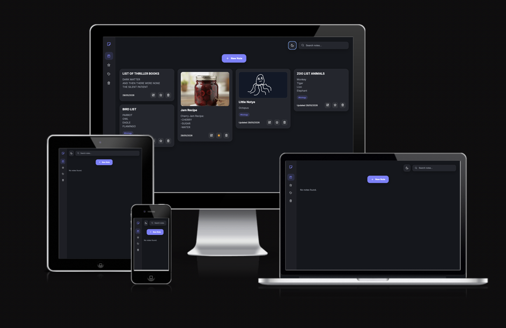


---

### 7.3 Browser Compatibility

The project was tested on:

- Google Chrome
- Safari
- Mozilla Firefox

No major compatibility issues were found.

---

### 7.4 Validator Testing

#### HTML Validation

HTML files were tested using the W3C HTML Validator.

Example screenshot:


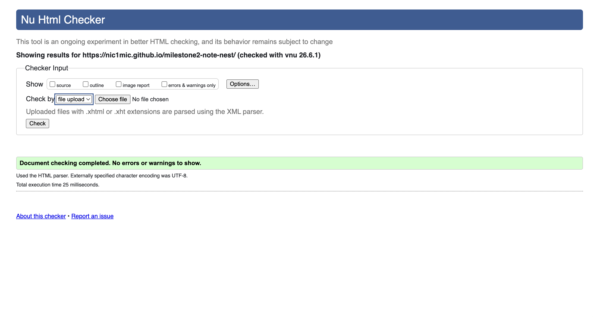


#### CSS Validation

CSS files were tested using the W3C CSS Validator.

Example screenshot:


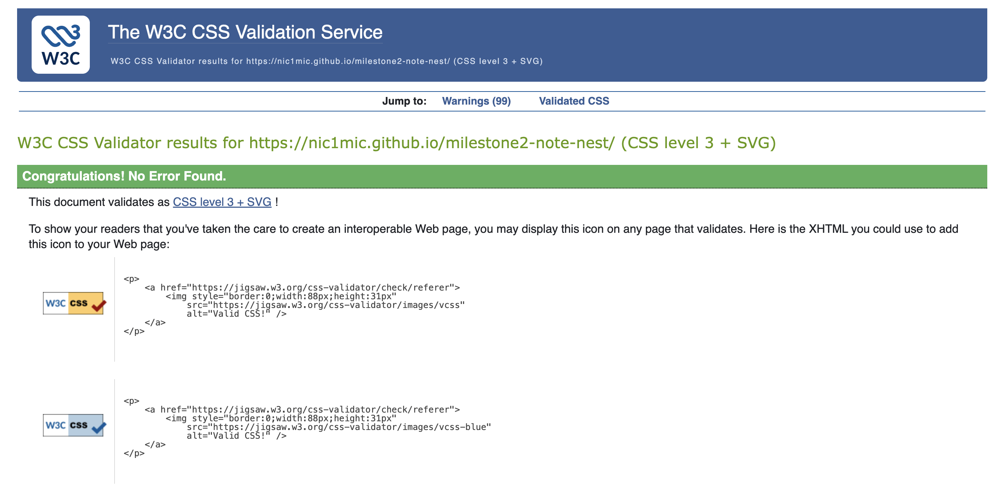


#### JavaScript Validation

JavaScript was tested using JSHint to identify syntax issues and improve code quality.

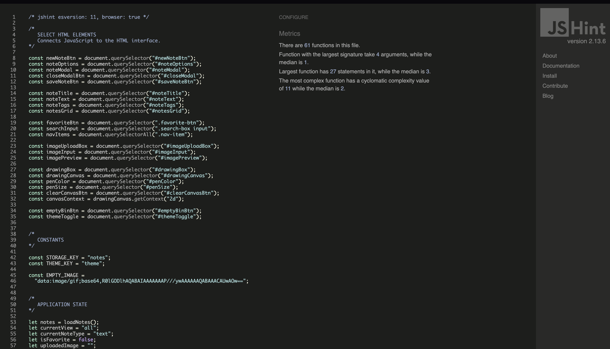


---

### 7.5 Lighthouse Testing

Google Chrome Lighthouse was used to evaluate:

- Performance
- Accessibility
- Best Practices
- SEO

Example screenshot:

Desktop mode:

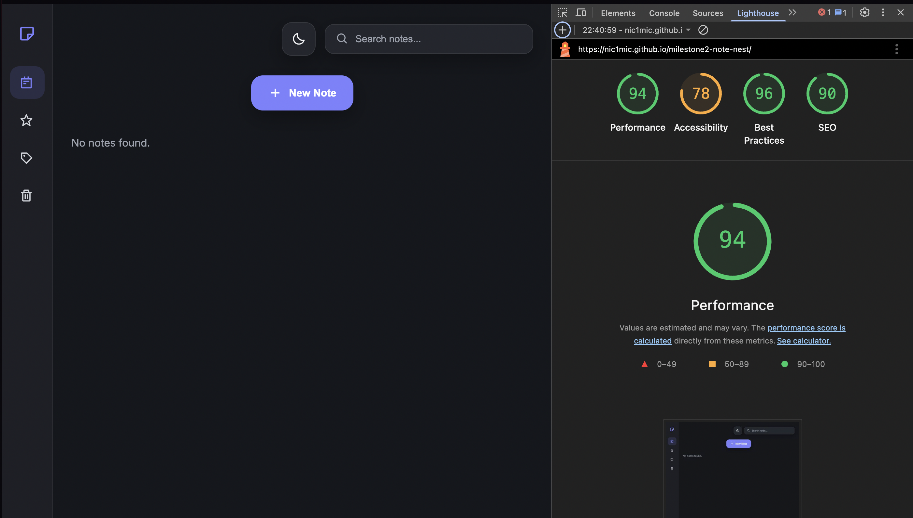

Mobile mode:

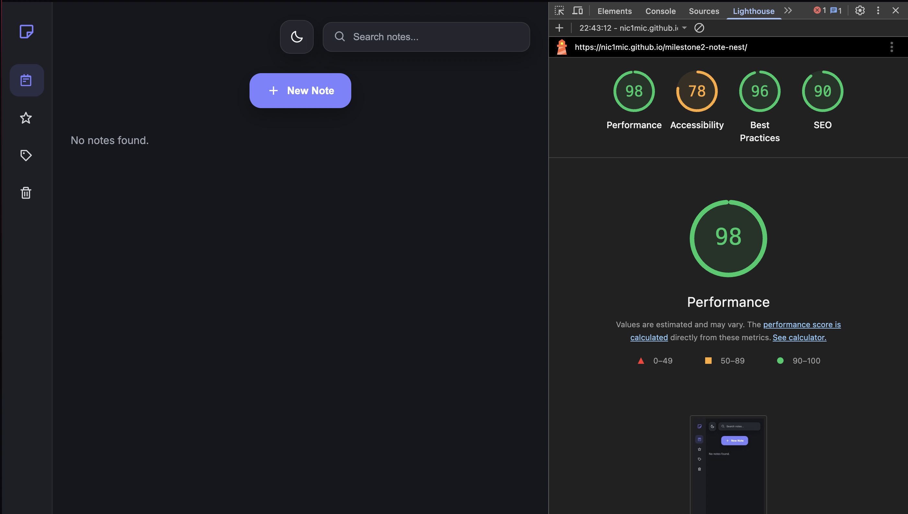


---

## 8. Bugs & Fixes

### Bug 1 – Sidebar Text Visible While Collapsed

**Issue:**  
Sidebar text remained partially visible when the sidebar was collapsed.

**Fix:**  
Applied `overflow: hidden` and opacity transitions to hide labels until hover.

---

### Bug 2 – Uneven Note Heights

**Issue:**  
Image and drawing notes created large empty spaces within the notes layout.

**Fix:**  
Adjusted the card layout and spacing to create a cleaner masonry-style appearance.

---

### Bug 3 – Image Preview Validation Error

**Issue:**  
The image preview element did not contain a valid image source before JavaScript loaded an image.

**Fix:**  
Added a placeholder image source to satisfy HTML validation requirements.

---

### Bug 4 – Missing Section Headings

**Issue:**  
The HTML validator reported missing section headings.

**Fix:**  
Added visually hidden headings to improve accessibility and semantic structure.

---

## 9. Credits & Attribution

### Inspiration

- Google Keep  
  https://keep.google.com/

### Icons

- Boxicons  
  https://boxicons.com/

### Resources

- MDN Web Docs  
  https://developer.mozilla.org/

- W3Schools  
  https://www.w3schools.com/

### Development Tools

- Git
- GitHub
- GitHub Pages
- Visual Studio Code

---

## 10. Future Improvements

Possible future enhancements include:

- Drag-and-drop note sorting
- Pinning important notes
- Custom note colours
- Advanced tag filtering
- Reminder notifications
- User authentication
- Cloud storage and synchronisation
- Shared notes and collaboration
- Voice note support
- Export notes to PDF

---

## 11. Author

Created by **Nic1Mic** – 2026

---

## 🌐 Live Demo

You can access the live project here:

[🔗 Open NoteNest](https://nic1mic.github.io/milestone2-note-nest/)